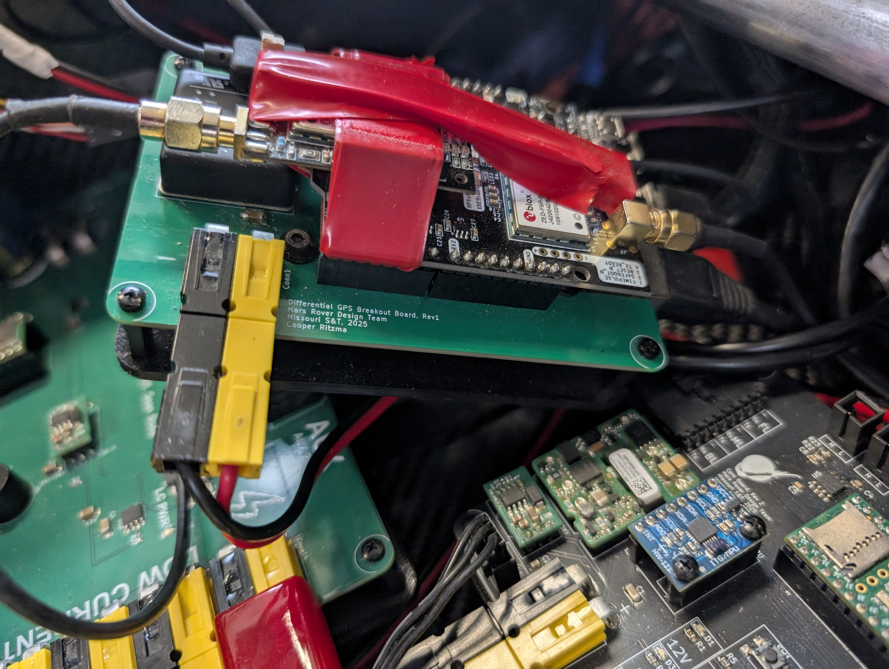
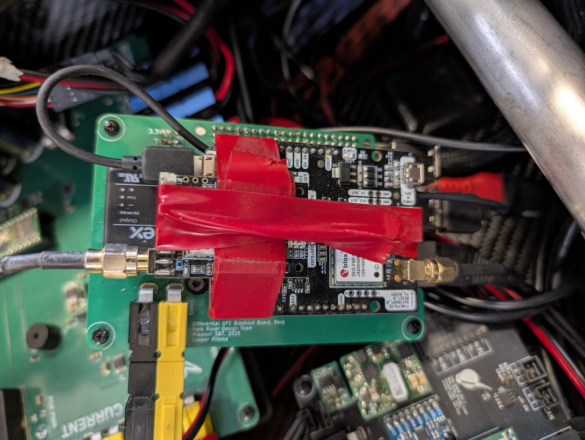

# Differential GPS Solution

This repository contains the necessary components to set up a Differential GPS (DGPS) solution for precise positioning. The system is divided into two parts: the **Rover-side** and the **Basestation-side**. Follow the instructions below to set up each side.

---

## Rover-Side Setup

The rover-side is responsible for receiving GPS corrections and sending GPS data to the rover's navigation system.

### Components:
1. **`nav_board.py`**  
   This script handles the GPS data processing and communication with the rover's navigation system. It uses the UBX protocol to decode GPS data and sends it to the rover via the RoveComm protocol.

2. **`nav_board.service`**  
   A systemd service to ensure `nav_board.py` runs automatically on system startup.

3. **`ntrip_to_serial.service`**  
   A systemd service to connect to the NTRIP correction service and forward corrections to the GPS receiver via a serial connection.

---

### Steps to Set Up the Rover-Side:

1. **Install Dependencies**  
   Ensure the following Python dependencies are installed:
   ```bash
   pip install pyserial pyubx2 rich utm
   ```

2. **Set Up `nav_board.py`**  
   - Place `nav_board.py` in a suitable directory (e.g., `/home/pi/Differential_GPS/`).
   - Ensure the script is executable:
     ```bash
     chmod +x /home/pi/Differential_GPS/nav_board.py
     ```

3. **Configure `nav_board.service`**  
   - Copy the `nav_board.service` file to the systemd directory:
     ```bash
     sudo cp nav_board.service /etc/systemd/system/
     ```
   - Reload systemd and enable the service:
     ```bash
     sudo systemctl daemon-reload
     sudo systemctl enable nav_board.service
     sudo systemctl start nav_board.service
     ```

4. **Configure `ntrip_to_serial.service`**  
   - Copy the `ntrip_to_serial.service` file to the systemd directory:
     ```bash
     sudo cp ntrip_to_serial.service /etc/systemd/system/
     ```
   - Reload systemd and enable the service:
     ```bash
     sudo systemctl daemon-reload
     sudo systemctl enable ntrip_to_serial.service
     sudo systemctl start ntrip_to_serial.service
     ```

5. **Verify Services**  
   Check the status of the services to ensure they are running:
   ```bash
   sudo systemctl status nav_board.service
   sudo systemctl status ntrip_to_serial.service
   ```

---

## Basestation-Side Setup

The basestation-side is responsible for broadcasting GPS corrections to the rover.

### Components:
1. **RTKBase**  
   The RTKBase repository provides the tools and services to set up a GNSS base station with a web frontend for configuration.

---

### Steps to Set Up the Basestation-Side:

1. **Clone the RTKBase Repository**  
   Clone the RTKBase repository to your system:
   ```bash
   git clone https://github.com/Stefal/rtkbase.git
   cd rtkbase
   ```

2. **Install RTKBase**  
   Run the installation script to set up RTKBase:
   ```bash
   sudo ./install.sh --all release
   ```

3. **Configure the GNSS Receiver**  
   If you are using a U-Blox ZED-F9P receiver, configure it using the following command:
   ```bash
   sudo ./install.sh --detect-gnss --configure-gnss
   ```

4. **Start RTKBase Services**  
   Start the necessary services for RTKBase:
   ```bash
   sudo systemctl start rtkbase_web
   sudo systemctl start str2str_tcp
   sudo systemctl start gpsd
   sudo systemctl start chrony
   sudo systemctl start rtkbase_archive.timer
   ```

5. **Access the Web Interface**  
   Open a web browser and navigate to the IP address of your basestation to access the RTKBase web interface.

6. **Verify Services**  
   Check the status of the RTKBase services:
   ```bash
   sudo systemctl status rtkbase_web
   sudo systemctl status str2str_tcp
   ```

---

## Additional Notes

- **Logging**: Logs for the rover-side services can be found in the system journal. Use `journalctl` to view logs:
  ```bash
  sudo journalctl -u nav_board.service
  sudo journalctl -u ntrip_to_serial.service
  ```

- **NTRIP Configuration**: Ensure the NTRIP caster details (e.g., URL, port, username, password) are correctly configured in the `corrections_command.txt` file or the RTKBase settings.

- **Dependencies**: Both the rover and basestation require Python 3 and systemd to be installed.

---

...

## Important Hardware Info

To ensure proper communication between the Raspberry Pi and the GNSS receiver, a **USB-A to Micro USB cable** must be connected as follows:

- **From**: The Raspberry Pi's **user header** (USB-A port).  
- **To**: The **Micro USB port** on the opposite side of the GNSS receiver board.

This connection is critical for powering and communicating with the GNSS receiver. Ensure the cable is securely connected to avoid interruptions in data transmission.

### Connection Diagram


*Figure 1: The full stack.*


*Figure 2: Diagram showing the USB connection from Raspberry Pi to the GNSS receiver*

...